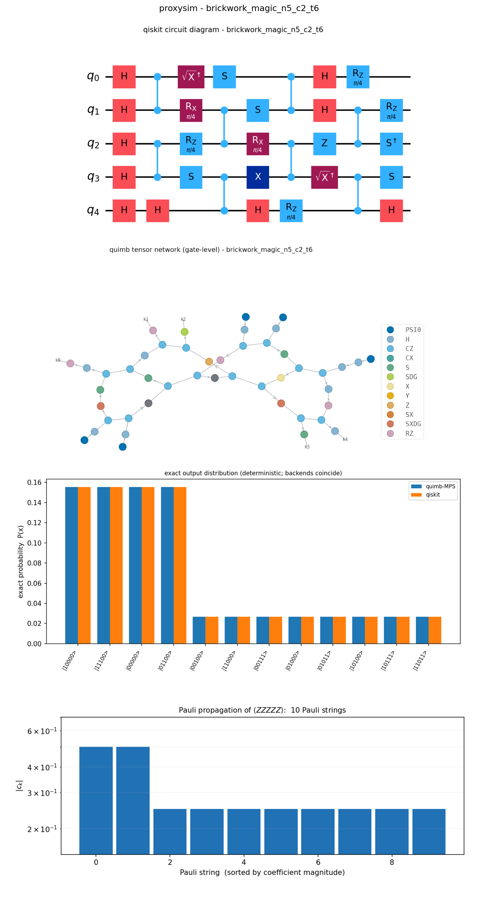
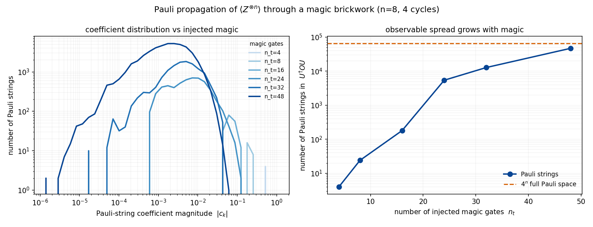
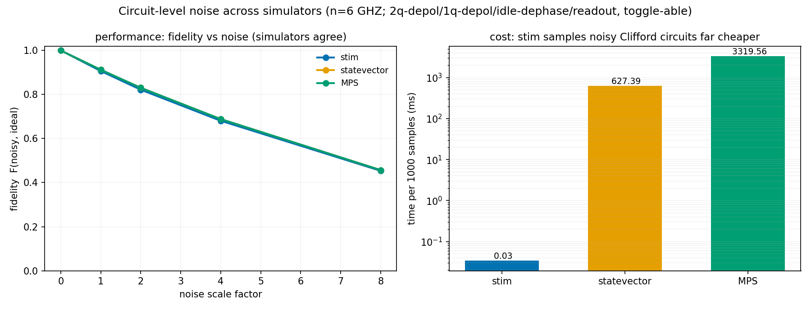

# proxysim

A small toolkit for running the *same* quantum circuit through several classical
simulators and seeing where they agree, how they scale, and what they cost. It
grew out of reading Merkel et al., ["When Clifford benchmarks are
sufficient"](https://arxiv.org/abs/2503.05943), while thinking about how to bound
the performance of near-term quantum computers without an exponential classical
bill.

The package name is `proxysim` (the repository is `quantumsim`).

## The three backends

Each backend takes a backend-agnostic circuit and produces the same thing: an
output bitstring distribution and a timing. They get there by completely
different routes, which is the whole point.

| backend | how it works | scales to | works on |
|---|---|---|---|
| `tensornetwork(quimb-MPS)` | matrix-product state, `swap+split` contraction | bounded-entanglement circuits | any gate |
| `statevector(qiskit)` | exact dense statevector | ~24 qubits (2ⁿ memory) | any gate |
| `stabilizer(stim)` | stabilizer tableau, or stim's native sampler | thousands of qubits when *sampling* | Clifford only |

The framing comes straight from the Merkel paper. A Clifford "proxy" circuit is
efficiently simulable on a stabilizer backend, and it can stand in for a
non-Clifford "target" that only tensor-network or statevector methods can touch.
proxysim lets you run both and check they line up.

## Exact by default

These circuits are noiseless and unitary, so the output is deterministic:
`P(x) = |⟨x|ψ⟩|²`. There is no reason to Monte-Carlo it. Each backend computes
that distribution *once* and we compare them. Drawing shots only adds sampling
noise to an answer we can already get exactly, so `run_all` returns the exact
distribution by default and treats shots as an opt-in.

Because the three methods are unrelated, their agreement is a real check rather
than a tautology. On a 5-qubit Clifford brickwork they line up to floating-point
precision:

```
backend                     exact (ms)  support    TVD@ref
tensornetwork(quimb-MPS)       123.779       16    7.4e-16
statevector(qiskit)              5.141       16    0.0e+00
stabilizer(stim)                 9.021       16    1.1e-15
```

Shots (`run_all(circuit, shots=N)`) become genuinely necessary once you turn on
noise, because a mixed state can't be read off as a single `|⟨x|ψ⟩|²`. That is
what the noise model below is for.



The panel above shows a small circuit four ways: the qiskit diagram, the quimb
tensor network, the exact output distribution (the backends coincide), and the
Pauli-propagation coefficient spread. Because this particular circuit has a few
magic gates it is non-Clifford, so stim sits it out automatically, which is
exactly the behavior you want.

## Install

The package is a normal editable install with no hard-coded paths, so it runs
the same from a fresh checkout on any machine:

```bash
git clone https://github.com/aswath-surya/quantumsim.git
cd quantumsim
python -m venv .venv
# Windows:  .venv\Scripts\activate      macOS/Linux:  source .venv/bin/activate
pip install -e .
```

A plain `pip install -e .` pulls quimb, qiskit, stim, matplotlib and pylatexenc,
which is everything you need including the plots. Two optional extras:

- `pip install -e ".[fast]"` adds kahypar and optuna for better quimb
  contraction paths.
- `pip install -e ".[pauliprop]"` adds juliacall for the PauliPropagation.jl
  wrapper (see below).

It was developed against a Python 3.12 environment with quimb 1.12, qiskit 2.4
and stim 1.15.

## Running the examples

```bash
python examples/visualize.py         # circuit + TN + distribution + Pauli-prop panel
python examples/run_5q_lnn.py        # the preliminary 5-qubit MPS run
python examples/run_compare.py       # the three backends agreeing exactly
python examples/run_depth_sweep.py   # how depth drives entanglement and cost
python examples/run_scaling.py       # cost vs qubit count; stim sampling to 1000 qubits
python examples/run_pauliprop.py     # Pauli-propagation expectation values
python examples/run_magic_coeffs.py  # magic vs the Pauli-coefficient distribution
python examples/run_noise_compare.py # noise: fidelity and time across simulators
```

Text results land in `results/` and the figures shown here are in `docs/`.

## Using it as a library

```python
from proxysim import Circuit, lnn_brickwork, run_all

c = lnn_brickwork(n=5, n_cycles=4, twoq="cz", mode="clifford")   # or mode="haar"
report = run_all(c)              # exact distributions + agreement check
print(report.to_text())
report = run_all(c, shots=8192)  # also draw a finite, hardware-style sample

# or build any circuit directly from the IR
c = Circuit(3)
c.h(0).cx(0, 1).cz(1, 2)
```

## The circuits

`lnn_brickwork` builds the linear-nearest-neighbour brickwork from Merkel et al.,
Fig. 3: an initial Hadamard layer, then alternating even and odd two-qubit
layers with single-qubit layers in between.

```
[initial Hadamard layer]
repeat n_cycles times:
    even pairs :  (0,1) (2,3) ...        # CZ or CX
    single-qubit layer
    odd pairs  :  (1,2) (3,4) ...
    single-qubit layer
```

Setting `n_cycles = n-1` fully entangles the chain. In `mode="clifford"` the
single-qubit gates are random Cliffords, so all three backends apply. In
`mode="haar"` they are `Z(φ₁)·√X·Z(φ₂)·√X·Z(φ₃)` with random angles, which is
non-Clifford, so stim steps aside and you are left with statevector and MPS.

`brickwork_magic(n, n_cycles, n_t)` is the same idea but with `n_t` injected π/4
"magic" gates, used in the Pauli-propagation study below.

## Pauli propagation

This is a different question from the rest of the package. Instead of asking for
a whole distribution, you push a single observable `O` backward through the
circuit in the Heisenberg picture and read off `⟨ψ|O|ψ⟩`. It stays cheap as long
as the propagated observable stays sparse, which it does under truncation and
especially under noise, and it is what process-fidelity and direct-fidelity
estimates are actually built from. (It is also reference [6] of the Merkel paper,
Angrisani et al.)

There are two implementations, and they check each other:

- `proxysim/pauliprop.py` is a thin wrapper around the real
  [PauliPropagation.jl](https://github.com/MSRudolph/PauliPropagation.jl) (Rudolph
  et al.). It boots Julia through juliacall, translates a proxysim circuit into
  `PauliRotation` and `CliffordGate` objects, and calls the package's `propagate`
  and `overlapwithzero`.
- `proxysim/pauliprop_validator.py` is a pure-Python implementation of the same
  algorithm that needs no Julia. It borrows `stim.PauliString` purely as a Pauli
  algebra engine (multiply with signs, check commutation, conjugate by a
  Clifford); it does not use stim's stabilizer simulator and is not connected to
  the Julia package. It exists so you can validate the wrapper, or run without
  Julia at all.

Both agree with qiskit statevector expectation values to about 1e-16, and with
each other. To use the wrapper:

```bash
pip install -e ".[pauliprop]"
python -c "from proxysim.pauliprop import ensure_installed; ensure_installed()"  # once
python examples/run_pauliprop.py
```

```python
from proxysim import lnn_brickwork, JuliaPauliPropagator, PauliPropagator

c = lnn_brickwork(6, 3, "cz", "haar")
JuliaPauliPropagator().expectation(c, "Z_____")          # via PauliPropagation.jl
PauliPropagator(max_weight=3).expectation(c, "Z_____")   # Julia-free, truncated
```

`max_weight` and `min_abs_coeff` are the truncation knobs, the same names
PauliPropagation.jl uses. Loosen them and the estimate converges to the exact
value; under depolarizing noise a small `max_weight` is already nearly lossless
because the high-weight Paulis have decayed.

### Magic and the coefficient spread

`run_magic_coeffs.py` propagates an observable through a brickwork with a growing
number of magic gates and looks at the coefficients of the resulting Pauli
strings. With no magic the observable stays a single Pauli. Each magic gate that
anticommutes with a term splits it in two (scaled by 1/√2), so the number of
Pauli strings climbs toward the full 4ⁿ space and the coefficients spread out
toward many small values. That spread is precisely what truncation exploits.



## Noise

`proxysim/noise.py` provides a `NoiseModel` with a single on/off toggle and four
channels: two-qubit depolarizing after each entangling gate, one-qubit
depolarizing after each single-qubit gate, dephasing on qubits that idle during a
layer, and readout bit-flips. It can be applied two ways: inserted as native stim
noise (exact and scalable, Clifford only), or sampled as Monte-Carlo trajectories
for the statevector and MPS backends.

`run_noise_compare.py` runs a noisy circuit through all three and compares the
fidelity of each noisy distribution to the ideal one, along with the time each
takes. The three agree, which validates them against each other, and stim is
about four orders of magnitude cheaper.



One honest caveat, visible in the code and the plot: a fidelity computed from the
Z-basis distribution cannot see pure dephasing, because Z errors leave the
diagonal of the density matrix untouched. That is physics, not a bug. Capturing
dephasing would need a state fidelity from a density-matrix simulation, which is
the natural next step.

## What the runs show

- `run_compare` — the MPS, statevector and stabilizer results are identical to
  ~1e-14. A Clifford proxy gives a uniform distribution over a stabilizer coset;
  a Haar target is non-uniform and stim skips it.
- `run_depth_sweep` — the MPS bond dimension and output entropy grow with depth
  and then saturate; for a Clifford brickwork the support is exactly 2^entropy.
- `run_scaling` — the full distribution is 2ⁿ for every method, so they all top
  out around 20 to 24 qubits. The genuinely scalable Clifford operation is
  sampling, where stim handles a thousand qubits in well under a second.

## Still to do

- A density-matrix backend so noise fidelity can include dephasing.
- GPU backends: cuStateVec via qiskit-aer-gpu or qulacs-gpu, and cuTensorNet
  through quimb's `contract_backend="cupy"` (there are stubs in
  `proxysim/backends/gpu.py`).
- Parallelism that actually pays off, meaning noise trajectories and many
  randomizations rather than shots of a single noiseless circuit (scaffold in
  `proxysim/parallel.py`).
- Larger runs across nodes with MPI.

## A note on conventions

Bitstrings are written with qubit 0 on the left throughout. The qiskit and stim
backends use little-endian internally and are converted for you, so you never
have to think about it at the API level.
