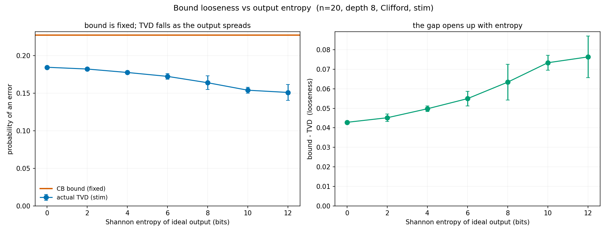
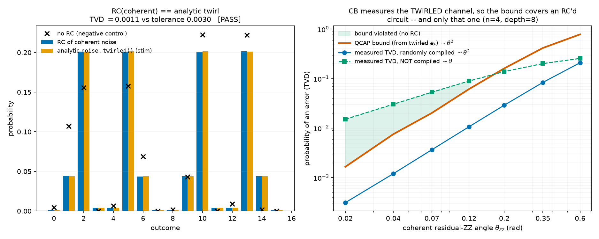

# proxysim

A multi-backend quantum-circuit simulator and benchmarking toolkit. The same
backend-agnostic circuit runs on a tensor-network (quimb MPS, optionally on GPU),
an exact statevector (qiskit), or a stabilizer (stim) backend, plus a
Pauli-propagation expectation-value engine — and on top of that it can bound
circuit error from cycle benchmarking. It grew out of Merkel et al., ["When
Clifford benchmarks are sufficient"](https://arxiv.org/abs/2503.05943): Clifford
"proxy" circuits are cheap to simulate (stabilizer), while their non-Clifford
targets need tensor-network or statevector methods.

Package name: `proxysim`. Repository: `quantumsim`.

## One entry point

Everything is reachable from `simulate(circuit, simulator=..., output=...)`, which
dispatches over two axes:

| axis | values |
|---|---|
| `simulator` | `statevector` · `tensornetwork` · `stabilizer` · `pauliprop` · `auto` |
| `output` | `distribution` · `samples` · `survival` · `expectation` |

with flags `noise` (a `NoiseModel`), `gpu` (tensor network on cupy), `max_bond`
(MPS truncation), and `parallel` / `n_workers`. `auto` picks the stabilizer backend
for Clifford circuits and the tensor-network backend otherwise.

```python
from proxysim import bench_brickwork, even_pairs, odd_pairs, NoiseModel, simulate

c = bench_brickwork(12, 3, [even_pairs(12), odd_pairs(12)], oneq="clifford").mirror()
simulate(c, "stabilizer", "distribution")                 # exact |<x|psi>|^2
simulate(c, "stabilizer", "survival", noise=NoiseModel(True, p2=5e-3))   # P(0...0) under noise
simulate(c, "tensornetwork", "survival", noise=..., max_bond=8, parallel=True)  # MPS trajectories, fanned out
simulate(c, output="expectation", observable="Z___________")            # Pauli propagation
```

## Install

```bash
git clone https://github.com/aswath-surya/quantumsim.git && cd quantumsim
python -m venv .venv && source .venv/bin/activate     # Windows: .venv\Scripts\activate
pip install -e .
```

A plain `pip install -e .` pulls quimb, qiskit, stim, matplotlib, pylatexenc — the
full CPU toolkit including plots. Optional extras: `.[fast]` (kahypar/optuna for
better quimb paths), `.[pauliprop]` (juliacall for the PauliPropagation.jl wrapper).
GPU needs `cupy-cuda12x`; multi-worker BLAS pinning uses `threadpoolctl` (both
optional). Developed on Python 3.12 with quimb 1.12, qiskit 2.4, stim 1.15.

## What every file is

**`proxysim/` — the package**

| file | role |
|---|---|
| `__init__.py` | public API surface; re-exports the whole toolkit |
| `simulate.py` | **the dispatcher** — `simulate()`, `make_backend`, `auto_simulator`, `noisy_survival`, `noisy_tvd_vs_support` |
| `circuit.py` | backend-agnostic `Circuit`/`Gate` IR; builders (`lnn_brickwork`, `brickwork_magic`, `clifford_entropy_circuit`, `bench_brickwork`); `mirror()`/`inverse()`; `even_pairs`/`odd_pairs`; `GATE_SETS` |
| `metrics.py` | distribution metrics (`total_variation_distance`, `classical_fidelity`, `shannon_entropy`, `tvd_to_ideal_support`) and result I/O (`save_results`/`load_results`, npz) |
| `noise.py` | `NoiseModel` (one toggle; Pauli channels: 2q/1q depolarizing, idle dephasing, readout, Z dephasing, correlated ZZ — plus optional **coherent** `theta_1q`/`theta_zz`, off by default, and `.twirled()` for the exact Pauli channel RC produces); `to_stim_noisy` (native stim noise) and `sample_trajectory`/`apply_readout` (trajectories) |
| `parallel.py` | single-node parallelism: `pmap`, `parallel_trajectories`, `sample_parallel`, with per-worker BLAS/thread pinning |
| `runner.py` | `run_all()` — compares the exact output distribution across all backends (`ComparisonReport`) |
| `benchmarking.py` | synthetic cycle benchmarking (`cycle_benchmark` via stim), `readout_fidelity`, the `qcap_bound`, `randomly_compile` |
| `rc.py` | randomized compiling — `pauli_twirl` wraps every 2q gate in a random Pauli and its conjugate, leaving the unitary unchanged; full Pauli group on Clifford entanglers, commuting `{I,Z}²` subgroup on `cp(theta)` |
| `cb_emit.py` | cycle-benchmarking circuits **as circuits** (rather than run in-process): `cb_circuit` builds one and returns the prep/measure Pauli, sign and support needed to analyze it; `survival` + `analyze_cb` turn shot data back into `e_F` |
| `qasm.py` | `circuit_to_qasm` / `write_qasm` — the IR → OpenQASM 2.0 writer, exact inverse of `circuit_from_qasm` |
| `mqtbank.py` | MQT Bench adapter: `fetch` (ALG level → IR), `repeat` (`U^d`), `cycle_census` (distinct entangling layers + multiplicities for the QCAP product), `proxies_for` |
| `pauliprop.py` | `JuliaPauliPropagator` — wrapper around the real PauliPropagation.jl via juliacall; **expectation values only** |
| `pauliprop_validator.py` | `PauliPropagator` — Julia-free reference for the same algorithm (uses `stim.PauliString` as a Pauli-algebra engine); **expectation values only** |
| `viz.py` | matplotlib drawings: qiskit circuit, quimb tensor network, distribution bars, Pauli-prop coefficient panel |

**`proxysim/backends/`**

| file | role |
|---|---|
| `base.py` | `Backend` ABC + `SimResult`; the exact-distribution / optional-sampling split |
| `statevector.py` | qiskit `Statevector` backend — `exact_distribution`, `amplitude`, `prob0` |
| `tensornetwork.py` | quimb `CircuitMPS` (swap+split) — `exact_distribution`, `amplitude`/`prob0` (O(n·D²), no dense vector), `max_bond_of`, GPU via `gpu=True` |
| `stabilizer.py` | stim backend (Clifford only) — exact tableau readout + native CHP sampler |
| `gpu.py` | `GPUTensorNetworkBackend` (real: quimb + cupy), `GPUStatevectorBackend` (stub: cuStateVec / qulacs-gpu) |

**`examples/`** — each is a thin experiment script (circuits + metrics come from the package); each saves a figure and, where relevant, an `.npz` of its results

| file | what it does |
|---|---|
| `_bootstrap.py` | puts the repo root on `sys.path`; defines `RESULTS_DIR` |
| `run_5q_lnn.py` | the preliminary 5-qubit MPS run |
| `run_compare.py` | the three backends agreeing on the exact distribution |
| `run_depth_sweep.py` | how depth drives entanglement / entropy / cost |
| `run_scaling.py` | cost vs qubit count; stim sampling to 1000 qubits |
| `visualize.py` | the 4-panel figure (circuit + TN + distribution + Pauli-prop) |
| `run_pauliprop.py` | Pauli-propagation expectation values (wrapper vs validator) |
| `run_magic_coeffs.py` | magic vs the Pauli-coefficient distribution |
| `run_noise_compare.py` | noise: fidelity and time across simulators (GHZ) |
| `run_bounding.py` | n=4 cycle-benchmark bound vs measured TVD (random + structured) |
| `run_bounding_clifford.py` | 20-qubit Clifford mirror circuits: bound vs error |
| `run_bound_vs_entropy.py` | bound looseness vs output Shannon entropy (fixed depth) |
| `run_bound_vs_cycles.py` | bound vs TVD vs number of cycles at fixed entropy |
| `run_coherent_rc.py` | coherent noise + randomized compiling: asserts (PASS/FAIL, self-calibrated tolerance) that RC of a `theta_zz` model reproduces `noise.twirled()`, then sweeps the angle to show the QCAP bound holding under RC and being violated at small angles without it |
| `run_qpe_bounding.py` | real MQT QPE circuit (`qpe11.qasm`): CB bound vs full-distribution TVD, swept over noise strength |
| `run_qft_bounding.py` | real MQT QFT circuit (`qft14.qasm`, non-Clifford): per-2q-gate dressed cycles, CB via Clifford proxy, summed-infidelity bound; shows the bound going vacuous when the ideal is a noise fixed point |
| `run_qec_vs_random.py` | bound vs actual performance for two families as noise grows, all on one shared log axis: a random moderate-entropy circuit (bound vs output-distribution TVD) and a rotated surface code (AKN bound vs the actual full-record TVD vs the pymatching-decoded LER). The bound is *tight* on the full-record TVD in both cases; the surface code's orders-of-magnitude drop to the LER is entirely decoding, not bound looseness |
| `run_parallel_hpc.py` | sample single-node parallel run (trajectories fanned across cores) |
| `build_qasm_bank.py` | generates the RC/CB QASM bank from MQT Bench (see below) — the one example that writes circuits instead of running them |
| `verify_qasm_bank.py` | correctness checks for that bank: QASM round-trip, RC unitary equivalence, RC-vs-coherent-noise, CB survival, `e_F` agreement with `cycle_benchmark` |

`qpe11.qasm` is the 12-qubit MQT-Bench QPE circuit loaded via
`proxysim.circuit.circuit_from_qasm`. Its ideal output is a delta at the correct
phase, so the full-distribution TVD collapses to `1 - P(peak)`; the bound is
correspondingly tight (a delta ideal is maximally far from uniform). The ideal is
read exactly off the MPS backend (bond 1 — a product state), but the noisy sweep
runs on the statevector backend: at n=12 QPE's all-to-all inverse-QFT is SWAP-bound
and MPS is ~25x slower, since MPS only pays off for local, bounded-entanglement
circuits.

`qft14.qasm` (MQT QFT-14) is **non-Clifford** -- its `cp(pi/2^k)` gates are
controlled-phases that stim cannot simulate and that standard Clifford cycle
benchmarking cannot be run on directly (a Pauli conjugated through `cp` is a sum of
Paulis, not one Pauli). `run_qft_bounding.py` handles this with the **Clifford
proxy** (Merkel et al. 2503.05943): each 2q gate is its own dressed cycle
(single-qubit layer, which absorbs the Hadamards + Pauli twirl, plus the entangling
gate plus idle dephasing), and CB benchmarks the *noise* that gate carries via a
Clifford entangler (CZ = `cp(pi)`); under gate-independent Pauli noise the proxy
`e_F` equals the real gate's. The example also illustrates the looseness extreme:
`QFT|0...0> = |+>^n` is a product state whose uniform Z-basis readout is a
**Pauli-noise fixed point**, so the actual Z-basis TVD is identically 0 while the
bound climbs to 1 -- the opposite of QPE's tight delta-ideal bound. This is NOT "no
noise": the plot also shows the state infidelity `1 - <psi|rho|psi>` rising to ~0.5,
and an exact density-matrix simulation confirms the state goes nearly maximally mixed
(fidelity ~0.26, purity ~0.08 at p1=2e-2, p2=5e-2) while the TVD stays 0 to machine
precision. The readout basis is simply blind to the damage -- coherent (non-Pauli)
noise would show up; Pauli noise on `|+>^n` cannot.

**root**: `pyproject.toml`, `requirements.txt`, `LICENSE`, `.gitignore`; `docs/`
(committed figures for this README), `results/` (generated outputs, gitignored).

## The RC/CB QASM bank

`examples/build_qasm_bank.py` writes a corpus of standalone OpenQASM 2.0 files for an
**external** runner — nothing in the bank is executed here. For each of six MQT Bench
algorithms (`qft`, `qftentangled`, `ghz`, `graphstate`, `dj`, `wstate`) at
n = 4, 6, …, 16 and depths 1, 2, 4, …, 128, with 20 randomizations each:

```
qasm_bank/
  manifest.json                          # index: per (algorithm, n) gate counts,
                                         # measured qubits, cycle census, proxies
  base/qft/n08.qasm                      # untwirled source circuit
  rc/qft/n08/d016/r03.qasm               # U^16, every 2q gate Pauli-twirled
  cb/n08/cz_q0q1/d016/r03.qasm           # 16 dressed proxy cycles
  cb/n08/cz_q0q1/d016/meta.json          # prep/meas Pauli, sign, support per r
```

```bash
python examples/build_qasm_bank.py --dry-run     # 10,122 files, 292 MB
python examples/build_qasm_bank.py
python examples/verify_qasm_bank.py
```

Three things about it are worth knowing before consuming it.

**RC depth is `U^d`.** A depth-`d` RC file is the algorithm repeated `d` times with
every two-qubit gate independently wrapped in a random Pauli and its conjugate, so all
20 randomizations at a given depth compute the *same* unitary (up to a global phase)
with differently-conjugated noise. The twirl is **uncompiled** — the Paulis are explicit
`x`/`y`/`z` gates rather than absorbed into neighbouring single-qubit gates the way
True-Q does it — which costs roughly 2× the single-qubit gate count. Adjacent Paulis are
merged, and a consumer that cares about the rest can run its own 1q optimization pass.
At the algorithmic level `cp(theta)` is non-Clifford, so it is twirled only over the
commuting `{I,Z}²` subgroup; Clifford entanglers get the full Pauli group.

**CB files are shared across algorithms, and need their `meta.json`.** A CB circuit
depends only on `(n, entangler, pair)`, not on which algorithm motivated it, so the bank
stores one set per width — that is the difference between ~3k and ~50k CB files, and
`manifest.json` records which proxies each algorithm needs. Following Merkel et al.
(2503.05943), the non-Clifford `cp(theta)` is benchmarked with a **CZ proxy**: under
gate-independent Pauli noise `e_F` is a property of the error channel, not the gate
angle. A CB `.qasm` is **not analyzable on its own** — recovering the decay point needs
the propagated Pauli's support and sign from the sidecar:

```python
survival = sign * mean(1 - 2 * parity(shot_bits[:, support]))   # exactly +1 noiseless
```

`proxysim.cb_emit.survival` and `analyze_cb` do this and the `A·f^m` fit, using the same
conversion as `cycle_benchmark` (`e_F = (1 - 4^-n)(1 - f)`).

**The QCAP bound needs the cycle census, not just the proxy.** CB is run on a couple of
representative cycles, but the bound is a product over every cycle the circuit actually
executes, `1 - F_RO · Π_c (1 - e_F_c)^{n_c}`. `manifest.json` carries the full census
(each distinct entangling ASAP layer with its multiplicity), which is what
`proxysim.benchmarking.qcap_bound` consumes.

One caveat inherited from the protocol: `cycle_benchmark` reports `e_F` for the
*Pauli-twirled* channel. A QCAP bound built from it describes a circuit that was
actually randomly compiled — run the untwirled `base/` circuit on hardware with coherent
error and the bound does not apply, because coherent error accumulates in amplitude
rather than probability. `verify_qasm_bank.py` check 4 demonstrates exactly this gap.

## Running on an HPC node (parallel)

The workhorse is `proxysim.parallel.pmap` — a parallel `map` over independent items
(noise trajectories, circuit instances, parameter points). The one detail that
matters: each worker pins its BLAS/OpenMP threads (default 1) so `n_workers`
processes don't each spawn a full thread pool and thrash the cores.

- statevector / tensor-network **trajectories** are CPU-bound and embarrassingly
  parallel → `n_workers = cores`, `threads_per_worker = 1`.
- one big contraction that already uses threaded BLAS → few workers, many threads.
- GPU tensor networks are single-device → one worker with `gpu=True`, not many
  CPU processes.

```python
simulate(circ, "tensornetwork", "survival", noise=noise, n_traj=4000,
         parallel=True, n_workers=None)          # None -> os.cpu_count()
```

`examples/run_parallel_hpc.py` is a sample run (same seeds serial vs parallel, so
the answers must match — that is the correctness check — while the wall-clock shows
the speedup). Process workers pickle the worker by reference, so the package must be
importable in the child (`pip install -e .`). On Linux the default `fork` start
method inherits everything cleanly; validate the multi-worker path on the target
node.

## GPU (tensor networks)

The tensor-network backend runs its contractions on the GPU by moving the MPS
tensors to cupy — the same code path, a different array backend:

```python
simulate(circ, "tensornetwork", "distribution", gpu=True)     # needs cupy + CUDA
# or:  from proxysim import TensorNetworkBackend; TensorNetworkBackend(gpu=True, max_bond=16)
```

Unlike statevector, tensor-network memory scales with the bond dimension, not `2^N`,
so GPU-TN is the path to genuinely larger systems when entanglement is bounded. A
dense GPU statevector (`GPUStatevectorBackend`) is a documented stub — it would buy
speed via cuStateVec/qulacs-gpu but not change the `2^N` wall.

## The science, briefly

**Exact by default.** These circuits are noiseless and unitary, so the output is
deterministic. `run_all` computes the exact distribution once per backend; the three
methods agree to ~1e-14. Shots are optional and only matter with noise.

**Pauli propagation** ([run_pauliprop.py](examples/run_pauliprop.py),
[run_magic_coeffs.py](examples/run_magic_coeffs.py)) evolves an *observable* backward
(Heisenberg picture) and returns `⟨ψ|O|ψ⟩`. Note it is an **expectation-value tool,
not a distribution tool**: a bitstring distribution `P(x)` is the Walsh–Hadamard
transform of all `2^n` diagonal-Pauli expectations, so you cannot read TVD off a few
`⟨Z_i⟩` (those give only the marginals). It is really the non-Clifford
generalization of stim's Pauli-frame tracking — a Clifford gate maps one Pauli to
one Pauli (so stim tracks a single Pauli, exactly and in poly time), whereas a
T/rotation splits it into a *sum* of Paulis (which Pauli propagation tracks, growing
~`2^t`, controlled by truncation). Accordingly `simulate()` sends `expectation` to
Pauli propagation and everything distributional (`distribution`/`survival`) to the
sampling backends.

**Noise + bounding.** `NoiseModel` adds Pauli-stochastic channels; cycle
benchmarking measures each entangling cycle's infidelity `e_F`, and the QCAP bound
`1 - F_RO·∏(1-e_F)^n` upper-bounds the circuit error (the AKN diamond-norm chain,
valid because the noise is Pauli). The bound is tight for low-entropy (mirror /
Loschmidt-echo) outputs and loosens as the output entropy grows.



**Coherent noise.** `theta_1q` (systematic `rz` over-rotation) and `theta_zz`
(residual always-on ZZ) are optional, default-off, and non-Pauli — so
`to_stim_noisy` refuses them and `simulate()` routes them to Monte-Carlo
trajectories on a pure-state backend. They exist because every Pauli channel here
is *unital*: uniform is a fixed point, so a Clifford circuit's noisy output stays
flat on its ideal coset and the TVD is quantised by the support size (measured at
n=4, depth 16: support 4/8/16 → 0.340/0.224/**0.001**, classes not overlapping).
Turning on `theta_zz=0.15` alone gives 0.207/0.190/0.207 — classes overlapping and
the full-support case no longer pinned at zero.

`noise.twirled()` returns the exact Pauli channel randomized compiling produces
(`rz(θ) → p_Z = sin²(θ/2)`; `cp(θ) → p_IZ = p_ZI = p_ZZ = sin²(θ/2)/4`), which is
what `cycle_benchmark` measures. `examples/run_coherent_rc.py` validates that
end-to-end against `rc.pauli_twirl` and shows the consequence: the QCAP bound
covers a randomly-compiled circuit and *only* that one, since the twirled rate is
`O(θ²)` while an un-compiled coherent error accumulates as `O(θ)`.



## Convention

Bitstrings are written with qubit 0 on the left throughout; the qiskit and stim
backends convert their native little-endian for you.
